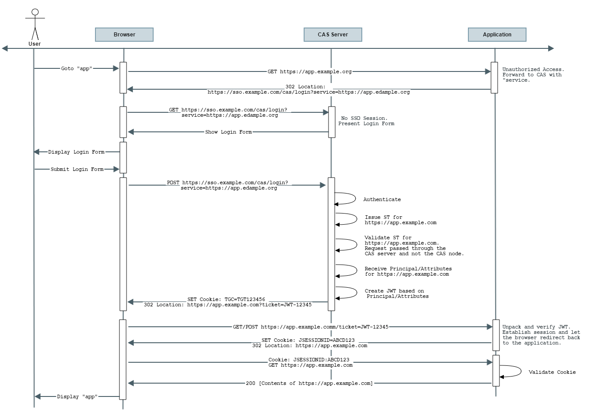

# JWT Service Tickets

[JSON Web Tokens](http://jwt.io/) are an open, industry standard RFC 7519 method for representing claims securely between two parties. 
CAS may also be allowed to fully create signed/encrypted JWTs and pass them back to the application in form of service tickets.

JWTs are entirely self-contained and contain the authenticated principal as well as all authorized attributes in form of JWT claims.

<div class="alert alert-info"><strong>JCE Requirement</strong><p>Make sure you have the proper JCE bundle installed in your Java 
environment that is used by CAS, specially if you need to use specific signing/encryption algorithms and methods. Be sure to pick 
the right version of the JCE for your Java version. Java versions can be detected via the <code>java -version</code> command.</p></div>

## Overview

JWT-based service tickets are issued to application based on the same semantics defined by the [CAS Protocol](../protocol/CAS-Protocol.html). 
CAS having received an authentication request via its `/login` endpoint will conditionally issue back `JWT` service tickets to the 
application in form of a `ticket` parameter via the requested http method.

All JWTs are by default signed and encrypted by CAS based on keys generated and controlled during deployment. Such keys may be 
exchanged with client applications to unpack the JWT and access claims.

## Flow Diagram

<a href="../images/cas_flow_jwt_diagram.png" target="_blank"></a>

Note that per the above diagram, the JWT request by default internally causes CAS to generate an `ST` for the application and immediately then validate it in
order to get access to the authenticated principal and attributes per policies associated with the application registration record in the
CAS service registry. This response is transformed into a `JWT` that is then passed onto the client application.

In other words, the responsibility of receiving a service ticket (`ST`) and validating it is all moved into and handled internally by CAS. 
The application only needs to learn how to decipher and unpack the final `JWT` and ensure its validity.

The expiration time of the generated `JWT` is controlled by the length of the assertion returned as part of the validation event. If the 
assertion validity length is not specified, then the expiration time is controlled by the length of the SSO session defined as part of SSO expiration policy of the CAS server. 

<div class="alert alert-warning"><strong>Not OpenID Connect</strong><p>Remember that you are just receiving a ticket in form of a JWT, 
thereby removing the need from your client to validate a normal service ticket. The ticket is internally validated by CAS and you as the client 
are only left in charge of validating the JWT itself. Do not confuse this with OpenID Connect. While a JWT, the token itself is not an ID token, 
cannot be refreshed and must be obtained again once you deem it expired. If you need more, consider using the OpenID Connect protocol instead. 
Note that the responsibility of validating the JWT is pushed onto <b>the client</b> and NOT the CAS server itself.</p></div>

## Configuration

JWT support is enabled by including the following dependency in the WAR overlay:

```xml
<dependency>
     <groupId>org.apereo.cas</groupId>
     <artifactId>cas-server-support-token-tickets</artifactId>
     <version>${cas.version}</version>
</dependency>
```

To see the relevant list of CAS properties, please [review this guide](../configuration/Configuration-Properties.html#jwt-tickets).

### Register Clients

Signal the relevant application in CAS service registry to produce JWTs for service tickets:

```json
{
  "@class" : "org.apereo.cas.services.RegexRegisteredService",
  "serviceId" : "^https://.*",
  "name" : "Sample",
  "id" : 10,
  "properties" : {
    "@class" : "java.util.HashMap",
    "jwtAsServiceTicket" : {
      "@class" : "org.apereo.cas.services.DefaultRegisteredServiceProperty",
      "values" : [ "java.util.HashSet", [ "true" ] ]
    }
  }
}
```

### Configure Keys Per Service

By default, the signing and encryption keys used to encode the JWT are global to the CAS server and can be defined via CAS settings. It is also possible
to override the global keys on a per-service basis, allowing each application to use its own set of signing and encryption keys. To do so, configure
the service definition in the registry to match the following:

```json
{
  "@class" : "org.apereo.cas.services.RegexRegisteredService",
  "serviceId" : "^https://.*",
  "name" : "Sample",
  "id" : 10,
  "properties" : {
    "@class" : "java.util.HashMap",
    "jwtAsServiceTicket" : {
      "@class" : "org.apereo.cas.services.DefaultRegisteredServiceProperty",
      "values" : [ "java.util.HashSet", [ "true" ] ]
    },
    "jwtAsServiceTicketSigningKey" : {
       "@class" : "org.apereo.cas.services.DefaultRegisteredServiceProperty",
       "values" : [ "java.util.HashSet", [ "..." ] ]
    },
    "jwtAsServiceTicketEncryptionKey" : {
         "@class" : "org.apereo.cas.services.DefaultRegisteredServiceProperty",
         "values" : [ "java.util.HashSet", [ "..." ] ]
    }
  }
}
```

## JWT Validation - AES

The following *example* code snippet demonstrates how one might go about validating and parsing the CAS-produced JWT
that is created using shared secrets via `AES`:

```java
import org.apache.commons.codec.binary.Base64;
import org.jose4j.jwe.JsonWebEncryption;
import org.jose4j.jwk.JsonWebKey;
import org.jose4j.jws.JsonWebSignature;
import org.jose4j.keys.AesKey;

import java.nio.charset.StandardCharsets;
import java.security.Key;

...

final String signingKey = "...";
final String encryptionKey = "...";

final Key key = new AesKey(signingKey.getBytes(StandardCharsets.UTF_8));

final JsonWebSignature jws = new JsonWebSignature();
jws.setCompactSerialization(secureJwt);
jws.setKey(key);
if (!jws.verifySignature()) {
    throw new Exception("JWT verification failed");
}

final byte[] decodedBytes = Base64.decodeBase64(jws.getEncodedPayload().getBytes(StandardCharsets.UTF_8));
final String decodedPayload = new String(decodedBytes, StandardCharsets.UTF_8);

final JsonWebEncryption jwe = new JsonWebEncryption();
final JsonWebKey jsonWebKey = JsonWebKey.Factory
    .newJwk("\n" + "{\"kty\":\"oct\",\n" + " \"k\":\"" + encryptionKey + "\"\n" + "}");

jwe.setCompactSerialization(decodedPayload);
jwe.setKey(new AesKey(jsonWebKey.getKey().getEncoded()));
System.out.println(jwe.getPlaintextString());
```
