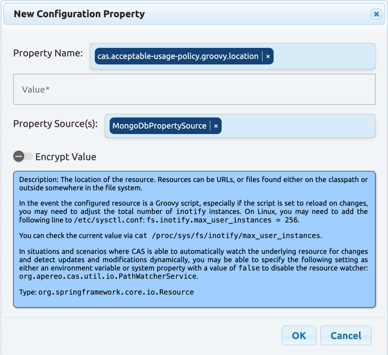



# 8.0.0-RC6 Release Notes

We strongly recommend that you take advantage of the release candidates as they come out. Waiting for a `GA` release is only going to set
you up for unpleasant surprises. A `GA` is [a tag and nothing more](https://apereo.github.io/2017/03/08/the-myth-of-ga-rel/). Note
that CAS releases are *strictly* time-based releases; they are not scheduled or based on specific benchmarks,
statistics or completion of features. To gain confidence in a particular
release, it is strongly recommended that you start early by experimenting with release candidates and/or follow-up snapshots.

## Apereo Membership

If you benefit from Apereo CAS as free and open-source software, we invite you
to [join the Apereo Foundation](https://www.apereo.org/content/apereo-membership)
and financially support the project at a capacity that best suits your deployment. Note that all development activity is performed
*almost exclusively* on a voluntary basis with no expectations, commitments or strings attached. Having the financial means to better
sustain engineering activities will allow the developer community to allocate *dedicated and committed* time for long-term support,
maintenance and release planning, especially when it comes to addressing critical and security issues in a timely manner.

## Get Involved

- Start your CAS deployment today. Try out features and [share feedback](/cas/Mailing-Lists.html).
- Better yet, [contribute patches](/cas/developer/Contributor-Guidelines.html).
- Suggest and apply documentation improvements.

## Resources

- [Release Schedule](https://github.com/apereo/cas/milestones)
- [Release Policy](/cas/developer/Release-Policy.html)

## System Requirements

The JDK baseline requirement for this CAS release is and **MUST** be JDK `25`. All compatible distributions
such as Amazon Corretto, Zulu, Eclipse Temurin, etc should work and are implicitly supported.

## New & Noteworthy

The following items are new improvements and enhancements presented in this release.

### OpenRewrite Recipes

CAS continues to produce and publish [OpenRewrite](https://docs.openrewrite.org/) recipes that allow the project to upgrade installations
in place from one version to the next. [See this guide](../installation/OpenRewrite-Upgrade-Recipes.html) to learn more.

### GraalVM Native Images

A CAS server installation and deployment process can be tuned to build and run
as a [Graal VM native image](../installation/GraalVM-NativeImage-Installation.html). We continue to polish native runtime hints.
The collection of end-to-end [browser tests based on Puppeteer](../../developer/Test-Process.html) have selectively switched
to build and verify Graal VM native images and we plan to extend the coverage to all such scenarios in the coming releases.

### Testing Strategy

The collection of end-to-end [browser tests based on Puppeteer](../../developer/Test-Process.html) continue to grow to cover more use cases
and scenarios. At the moment, total number of jobs stands at approximately `551` distinct scenarios. The overall
test coverage of the CAS codebase is approximately `94%`.

### Gradle 9.6

CAS is now built with Gradle `9.6.x` and the build process has been updated to use the latest Gradle
features and capabilities.

The build system is also internally refactored and heavily optimized:

- The Gradle build is made compatible with Gradle's [Isolated Projects](https://docs.gradle.org/current/userguide/isolated_projects.html) 
feature by default. This required a significant refactoring of how project dependencies, plugins and coordinates are resolved during the build and bundling 
process to ensure they are compliant with Spring Boot and Gradle's model for project isolation.
- Running CAS integration and unit tests are now significantly faster locally, thanks to better parallelism and less instrumentation.

### JSpecify & NullAway

CAS codebase is now annotated with [JSpecify](https://jspecify.dev/) annotations to indicate nullness contracts on method parameters,
return types and fields. We will gradually extend the coverage of such annotations across the entire codebase in future releases
and will integrate the Gradle build tool with tools such as [NullAway](https://github.com/uber/NullAway) to prevent nullness contract violations
during compile time.

### Palantir

[Palantir](../installation/Admin-Dashboard.html) now supports auto-complete and a small info panel to explain
available configuration properties when dynamic configuration sources are available and configuration metadata is enabled. 
The drop-down that lists configuration properties also supports searching for fields based on `name` and `description`.

Note that the documentation for each configuration property is directly extracted from 
the [CAS configuration catalog](../configuration/Configuration-Metadata-Repository.html)
and may not be immediately available if the property is not fully documented, particularly if it's owned and managed by
a third-party library.
  
### Redis Ticket Registry

The [Redis Ticket Registry](../ticketing/Redis-Ticket-Registry.html) now presents several notable changes, particularly important when administrative logouts are exercised:
                                                                   
- Delete operation signals are now propagated to all other consumer CAS nodes when Redis messaging is enabled. 
- Local cache invalidation is now restored to use the correct cache key when consumer CAS nodes receive a delete operation signal.
- Removing SSO sessions based on a principal now also propagates delete operation signals to consumer CAS nodes and invalidates the local cache for the publisher CAS node.

There are also significant performance optimizations available to ensure entries in Redis carry smaller objects:

- RedisSearch disabled/unavailable: often `45-70%` less memory per ticket record, because JSON documents stored are compressed and the registry stops writing `service` and `attributes` fields into entries.
- RedisSearch enabled: likely `40-65%` less per ticket record, mostly from compressed JSON documents.
- Crypto operations enabled: much smaller gain, often near `0-15%`, because CAS stores an encoded/encrypted ticket payload that is already high entropy. 

### Google Authenticator via Redis

[Google Authenticator](../mfa/GoogleAuthenticator-Authentication.html) 
backed [by Redis](../mfa/GoogleAuthenticator-Authentication-Registration-Redis.html) is now correctly tracking
and *updating* scratch codes assigned to the principal, removing the possibility of lingering orphaned scratch codes.
 
### Locale & Language Bundles

CAS language bundles for all supported languages are now comprehensively translated and include
all relevant language keys for each language. CAS themes also gain an option to enable and control a curated list of
available languages for user selection and displays. The user interface is also instructed to automatically set the 
`dir` attribute on appropriate fields to support right-to-left languages automatically using the browser.
  
### OpenID Connect Dynamic Client Registration

Several notable changes are now implemented 
for [OpenID Connect Dynamic Client Registration](../authentication/OIDC-Authentication-Dynamic-Registration.html)
to tighten and improve the security posture of registration request:

- Security rules that control access to the dynamic client registration endpoint are now hardened to prevent abuse and unauthorized access.
- `jwks_uri` field in dynamic client registration requests cannot be include any spring expressions.
- `jwks`  field in dynamic client registration requests cannot be include any spring expressions.
- Detailed error messages and root causes, as the result of invalid JSON keys, are no longer reported verbosely back.

## Other Stuff
              
- [OpenID Connect logout requests](../authentication/OIDC-Authentication-Logout.html) may now also be submitted via `POST`. 
- Redis integration tests have switched to use Redis `8.8.x`.
- The [Spring Expression Language](../configuration/Configuration-Spring-Expressions.html) parser is tightened to run in a sandboxed environment.
- [Delegated authentication](../integration/Delegate-Authentication.html) can now handle JSON serialization of complex attribute definitions that may carry maps. 
- Small enhancements to [CAS audits](../audits/Audits.html) to correctly identify the audited principal.
- [Delegated authentication](../integration/Delegate-Authentication.html) logout requests can now redirect to the original application as instructed when working with external OpenID Connect providers. 
